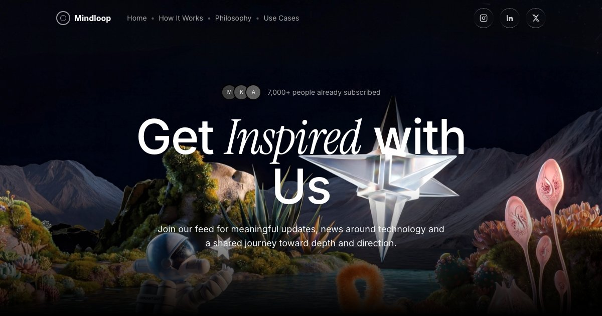
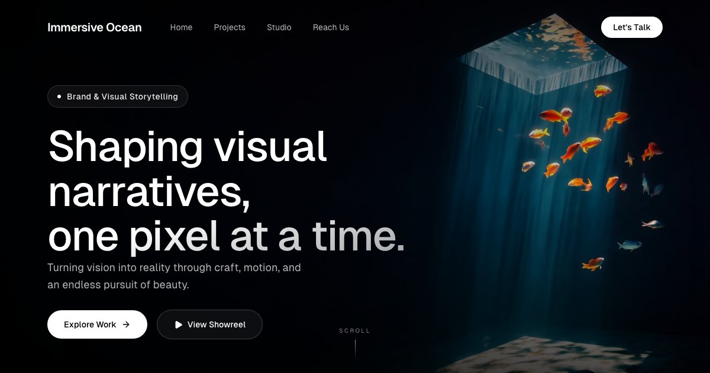
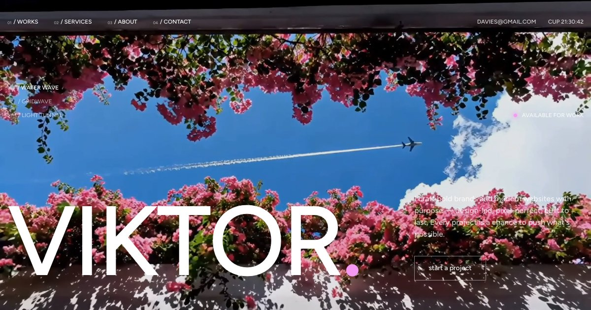
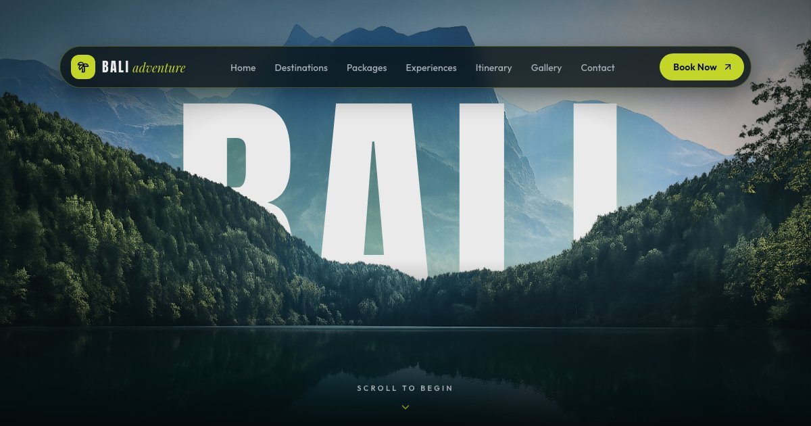
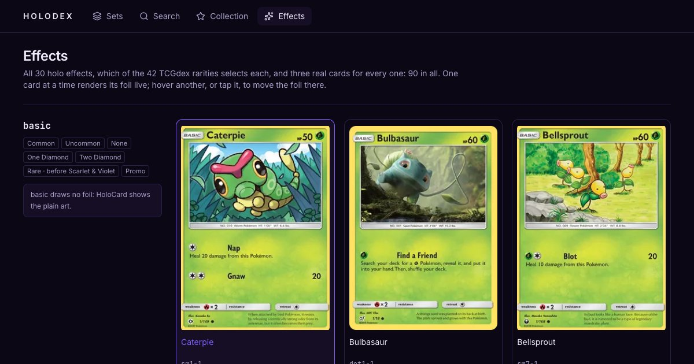
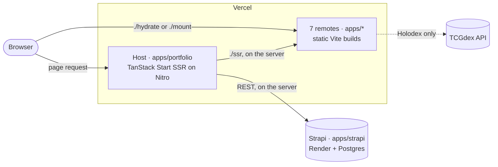

# ncam.dev

[](https://github.com/annminn104/ncam.dev/actions/workflows/ci.yml)
[](https://github.com/annminn104/ncam.dev/actions/workflows/codeql.yml)
[](LICENSE)

A personal portfolio built as a **micro-frontend showcase**. A server-rendered
**TanStack Start** host mounts each project at runtime through **Module
Federation**, and every project stays its own Vite app: built, tested and
deployed on its own.

**Live:** [ncam-profile.vercel.app](https://ncam-profile.vercel.app)

<table>
  <tr>
    <td align="center" width="33%">
      <a href="https://ncam-profile.vercel.app/projects/toonhub"></a>
      <br><sub><b>TOONHUB</b> · Collectible figurines</sub>
    </td>
    <td align="center" width="33%">
      <a href="https://ncam-profile.vercel.app/projects/mindloop"></a>
      <br><sub><b>Mindloop</b> · Newsletter / content platform</sub>
    </td>
    <td align="center" width="33%">
      <a href="https://ncam-profile.vercel.app/projects/immersive-ocean"></a>
      <br><sub><b>Immersive Ocean</b> · Creative studio hero</sub>
    </td>
  </tr>
  <tr>
    <td align="center" width="33%">
      <a href="https://ncam-profile.vercel.app/projects/viktor"></a>
      <br><sub><b>Viktor.</b> · Creative portfolio hero</sub>
    </td>
    <td align="center" width="33%">
      <a href="https://ncam-profile.vercel.app/projects/bali"></a>
      <br><sub><b>Bali Adventure</b> · Luxury travel landing page</sub>
    </td>
    <td align="center" width="33%">
      <a href="https://ncam-profile.vercel.app/projects/holodex"></a>
      <br><sub><b>Holodex</b> · Pokémon TCG explorer</sub>
    </td>
  </tr>
</table>

## Contents

- [What's inside](#whats-inside)
- [Architecture](#architecture)
- [Tech stack](#tech-stack)
- [Getting started](#getting-started)
- [Scripts](#scripts)
- [Configuration](#configuration)
- [Adding a project](#adding-a-project)
- [Quality gates and contributing](#quality-gates-and-contributing)
- [Deployment](#deployment)
- [Troubleshooting](#troubleshooting)
- [License](#license)

## What's inside

A Turborepo monorepo on pnpm workspaces, TypeScript everywhere.

| Path                   | What it is                                                                                                                                          | Dev port |
| ---------------------- | --------------------------------------------------------------------------------------------------------------------------------------------------- | -------- |
| `apps/portfolio`       | **Host.** TanStack Start (SSR on Nitro) and TanStack Router, React 19: the home page, the project gallery, the `/projects/<id>` stage and the blog. | 9000     |
| `apps/toonhub`         | TOONHUB: a collectible-figurine carousel hero. Framework-free TypeScript.                                                                           | 9001     |
| `apps/mindloop`        | Mindloop: a dark newsletter landing page. React 19, Tailwind v4, framer-motion, hls.js.                                                             | 9002     |
| `apps/immersive-ocean` | Immersive Ocean: a creative-studio hero over a looping video. React 19, Tailwind v4.                                                                | 9003     |
| `apps/viktor`          | Viktor.: a portfolio hero with a crossfading video switcher. React 19, Tailwind v4.                                                                 | 9004     |
| `apps/bali`            | Bali Adventure: a cinematic luxury-travel landing page. React 19, Tailwind v4, GSAP ScrollTrigger, framer-motion.                                   | 9005     |
| `apps/profile`         | The home page's six sections (hero, stacks, experience, projects, blog, contact), one federated module each.                                        | 9006     |
| `apps/holodex`         | Holodex: a Pokémon TCG explorer on the TCGdex API, with nested URLs of its own and three.js holo foil cards. React 19, Tailwind v4, TanStack Query. | 9007     |
| `apps/strapi`          | Strapi 5 headless CMS for the blog, with a public read-only REST API. A backend service, not a remote.                                              | 1337     |

| Package                  | What it is                                                                                                   |
| ------------------------ | ------------------------------------------------------------------------------------------------------------ |
| `@ncam/project-registry` | The typed list of projects that the gallery, the project routes and the sitemap read.                        |
| `@ncam/mf-remote`        | `defineRemote()`, every remote's Vite config; the `.env` reader; the `MountConfig` / `MountHandle` contract. |
| `@ncam/cms`              | A typed Strapi client and the `BlogPost` view model, for server-side use.                                    |
| `@ncam/design-tokens`    | CSS custom properties shared by the host and the profile remote.                                             |
| `@ncam/logger`           | An isomorphic logger for the apps.                                                                           |
| `@ncam/tsconfig`         | The shared base TypeScript config.                                                                           |

Every app, and most packages, carry an `AGENTS.md` with the rules for that
unit; the root [`AGENTS.md`](AGENTS.md) covers cross-cutting concerns.

## Architecture



1. **One registry.** `@ncam/project-registry` holds each project's id, copy,
   accent, thumbnail and remote name, and the gallery, the project routes and
   the sitemap all read it.
2. **Server render.** Opening `/projects/<id>` runs a route loader that loads
   the remote's `./ssr` module from its deployed `remoteEntry.ssr.js` and
   inlines the `{ html, css }` it returns. Federated SSR runs in production
   builds only; under `vite dev` every remote mounts on the client.
3. **Hydrate or mount.** In the browser the host imports `./hydrate`, or
   `./mount` when there is no server HTML. Every entry takes a `MountConfig`
   (`route`, `onNavigate`, `assetBase`) and returns a `MountHandle`, a
   disposer.
4. **Route-aware remotes.** A remote can own nested URLs:
   `/projects/holodex/sets/swsh3` hands Holodex its own path, `/sets/swsh3`.
   When that path changes, the host calls `MountHandle.update(route)` instead
   of remounting, so a WebGL context, a query cache or a scroll position
   survives in-app navigation. Holodex is the first remote to do this.
5. **Self-contained remotes.** Each remote bundles its own runtime, React
   included where it uses React. With `shared: {}` nothing crosses the
   host↔remote boundary, so a remote behaves the same standalone and mounted.
   `packages/mf-remote` holds that Vite config.
6. **A federated home page.** The home page's six sections are modules of the
   `profile` remote (`profile/hero` … `profile/contact`). The host
   server-renders them one after another within a 4 s budget; a module that
   fails or runs out of time mounts on the client instead, and the manifest
   rail shows each module's real lifecycle.
7. **Blog.** The host reads Strapi on the server only, through TanStack Start
   server functions. See [docs/cms.md](docs/cms.md).

## Tech stack

| Area       | Tools                                                                                                          |
| ---------- | -------------------------------------------------------------------------------------------------------------- |
| Host       | TanStack Start and TanStack Router, React 19, Nitro                                                            |
| Federation | `@module-federation/vite`, with server-side remote entries                                                     |
| Remotes    | Vite 8, React 19 or plain TypeScript, Tailwind CSS v4, GSAP, framer-motion, hls.js, three.js, TanStack Query   |
| CMS        | Strapi 5: SQLite in development, Postgres in Docker and on Render                                              |
| Tooling    | pnpm workspaces, Turborepo, TypeScript, Vitest, ESLint (flat config), Prettier, Husky, lint-staged, commitlint |
| Hosting    | Vercel (the host and the remotes), Render (the CMS), Docker Compose (the whole stack)                          |

## Getting started

**Prerequisites:** Node 22 (see `.nvmrc`; `pnpm thumbnails` needs 22.18 or
later) and pnpm, which `corepack enable` installs at the version pinned in
`package.json`.

```bash
corepack enable
pnpm install
pnpm dev        # host :9000, remotes :9001–:9007, Strapi :1337
```

Open http://localhost:9000 and pick a project. The host loads that remote at
runtime, so the remote's dev server must be running, which `pnpm dev` takes care
of. Strapi's first run writes `apps/strapi/.env` with generated secrets; then
register the first admin user at http://localhost:1337/admin
([docs/cms.md](docs/cms.md)).

To work on one app:

```bash
pnpm --filter @ncam/holodex dev     # a remote alone, on its standalone page at :9007
pnpm --filter @ncam/portfolio dev   # the host alone; projects fail to load until their remote runs
```

## Scripts

Run from the repo root.

| Command                        | Does                                                                                                     |
| ------------------------------ | -------------------------------------------------------------------------------------------------------- |
| `pnpm dev`                     | Every dev server, through Turbo.                                                                         |
| `pnpm build`                   | Builds every workspace: the host to `.output/` (a Nitro server), the remotes to `dist/`.                 |
| `pnpm preview`                 | Serves the production builds locally.                                                                    |
| `pnpm typecheck`               | `tsc --noEmit` in every workspace.                                                                       |
| `pnpm lint` / `lint:fix`       | ESLint (flat config).                                                                                    |
| `pnpm format` / `format:check` | Prettier.                                                                                                |
| `pnpm test` / `test:watch`     | Vitest over the shared packages, Strapi, Holodex, the host's `src/lib` and the apps' scripts.            |
| `pnpm run ci`                  | Lint, format check, typecheck, test and build, as CI runs them. (`pnpm ci` is pnpm's own clean install.) |
| `pnpm assets`                  | Downloads self-hosted assets where an app defines them (currently TOONHUB's figurines).                  |
| `pnpm thumbnails [id...]`      | Regenerates gallery thumbnails; see [Adding a project](#adding-a-project).                               |
| `pnpm skills:add`              | Installs the agent skills listed in `scripts/add-agent-skills.sh`.                                       |

## Configuration

Non-secret defaults live in the committed `.env`, and machine-specific
overrides go in `.env.local` (gitignored). The real environment wins over
`.env.local`, which wins over `.env`. The runtime `STRAPI_*` variables are the
exception: the built server reads them from the real environment only. Never
put secrets in `.env`.

Below, `<NAME>` stands for `TOONHUB`, `MINDLOOP`, `IMMERSIVE_OCEAN`, `VIKTOR`,
`BALI`, `PROFILE` or `HOLODEX`.

| Variable                          | Purpose                                                                                                                                                                                           |
| --------------------------------- | ------------------------------------------------------------------------------------------------------------------------------------------------------------------------------------------------- |
| `PORTFOLIO_PORT`, `<NAME>_PORT`   | Dev and preview ports.                                                                                                                                                                            |
| `<NAME>_REMOTE_URL`               | The `remoteEntry.js` URL the host loads for each remote. **Baked in at build time.**                                                                                                              |
| `<NAME>_BASE`                     | Each remote's public base path (default `/`).                                                                                                                                                     |
| `SITE_URL`                        | The site's public origin, for canonical URLs, Open Graph, JSON-LD, `robots.txt` and `sitemap.xml`. **Baked in at build time.** Falls back to Vercel's production domain, then `https://ncam.dev`. |
| `STRAPI_URL`, `STRAPI_PUBLIC_URL` | The CMS origin the host's server fetches from, and the origin browsers load media from (defaults to `STRAPI_URL`). **Read at runtime**; default `http://localhost:1337`.                          |

## Adding a project

1. Create `apps/<id>/`, a Vite app whose `vite.config.ts` calls
   `defineRemote()` from `@ncam/mf-remote` and exposes `./mount`, `./ssr` and
   `./hydrate` (copy `apps/viktor`). Its `build` script is `vite build --app`,
   which also emits the server entry.
2. Give it an `AGENTS.md` and a `vercel.json` (copy any remote's), and add its
   `<NAME>_PORT` and `<NAME>_REMOTE_URL` to `.env`.
3. In the host, add the remote to `remotes` in `apps/portfolio/vite.config.ts`;
   add one static `import('<remote>/ssr')`, `'/hydrate'` and `'/mount'` to the
   loader maps in `apps/portfolio/src/components/ProjectStage.tsx`; and type the
   modules in `apps/portfolio/src/types/remote/<id>.d.ts`.
4. Register it in `packages/project-registry`, whose tests enforce the shape.
   Set `routeAware: true` if it owns nested URLs; otherwise the host sends
   deeper paths a `noindex` and a canonical back to the project page.
5. For Docker, copy a remote's service in `docker-compose.yml`: it runs the
   remote's `preview` with `network_mode: service:portfolio`, so publish its
   port on the `portfolio` service instead of its own. Add an
   `ARG <NAME>_REMOTE_URL` defaulting to `http://localhost:<port>/remoteEntry.js`
   to the `Dockerfile`, and an upstream at `portfolio:<port>` plus a server
   block to `nginx/nginx.conf`. The comments in those three files say why.
6. With `pnpm dev` running, generate its thumbnail: `pnpm thumbnails <id>`.

**Thumbnails** are generated, not designed. Each gallery card and each project
page's `og:image` is a 1200×630 Playwright capture of `/projects/<id>` on the
running host, with the host's back button hidden
(`apps/portfolio/scripts/capture-thumbnails.mjs`), saved to
`apps/portfolio/public/thumbnails/<id>.jpg`. The script needs Playwright's
Chromium once (`pnpm --filter @ncam/portfolio exec playwright install chromium`).
Re-run it whenever a remote's first screen changes rather than editing an image.

## Quality gates and contributing

- Commits follow **Conventional Commits** (`feat(portfolio): …`,
  `fix(holodex): …`), checked by commitlint.
- **Husky** runs lint-staged (ESLint `--fix` and Prettier) before each commit,
  commitlint on each message, and `turbo run typecheck build` before each push.
  Skip the push check in a pinch with `git push --no-verify`.
- **CI** (`.github/workflows/ci.yml`) runs lint, format check, typecheck, test
  and build on every push to `main` and on every pull request, keeping the Turbo
  cache between runs. It also audits dependencies
  (`pnpm audit --audit-level high`) and lints a pull request's commit messages.
- **CodeQL** scans on push, on pull requests and weekly. **Dependabot** opens
  weekly update pull requests for npm (grouped), GitHub Actions and Docker.
- Open pull requests against `main`, and run `pnpm run ci` first. Read the
  `AGENTS.md` of any app you change.
- Report vulnerabilities as described in [`SECURITY.md`](SECURITY.md).

## Deployment

- **Vercel** serves the host (a Nitro server) and the seven remotes (static
  builds), one project per app, each configured by its own `vercel.json`. The
  host bakes each `<NAME>_REMOTE_URL` in at build time.
- **Render** runs Strapi and its Postgres from [`render.yaml`](render.yaml),
  and a scheduled workflow keeps the free service awake.
- **Docker Compose** runs the whole stack from one image:
  `docker compose up --build`.

Step-by-step setup, the environment each project needs and the free-plan
limits: [docs/deployment.md](docs/deployment.md).

## Troubleshooting

- **`cannot find binary path` on `pnpm dev`:** Turbo cannot find pnpm. Install
  it (see [Getting started](#getting-started)) and don't use `npm run dev`.
- **"Couldn't load <project>" in the host:** that remote's dev server is not
  running, or its `<NAME>_REMOTE_URL` points elsewhere. Run `pnpm dev` at the
  root.
- **`pnpm thumbnails` fails:** it needs the dev servers up, Node 22.18 or later
  and Playwright's Chromium.
- **Strapi says `App keys are required` or `Missing auth.secret`:**
  `apps/strapi/.env` is missing. `pnpm --filter @ncam/strapi dev` creates it, as
  does `pnpm --filter @ncam/strapi setup:env`.
- **Strapi fails with `EADDRINUSE :1337`:** another Strapi, or the Docker
  container, already holds port 1337. Run `docker compose stop strapi`, or set
  `PORT` in `apps/strapi/.env`.

## License

[MIT](LICENSE)
